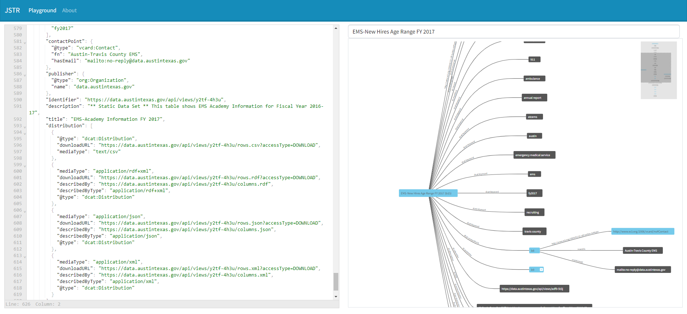

# RDF Playground

This site was inspired by [json-ld playground](https://json-ld.org/playground/). When dealing with large JSON-LD content, their visualizer broke. This is a pure Angular version using web worker to offload heavy calculation from the main browser thread. 

## Demo

Demo is available at https://johnra74.github.io/rdf-playground-web/

## Development server

Run `ng serve` for a dev server. Navigate to `http://localhost:4200/`. The application will automatically reload if you change any of the source files.

## Build

Run `ng build` to build the project. The build artifacts will be stored in the `dist/` directory.

## Running unit tests

Run `ng test` to execute the unit tests via [Karma](https://karma-runner.github.io).

